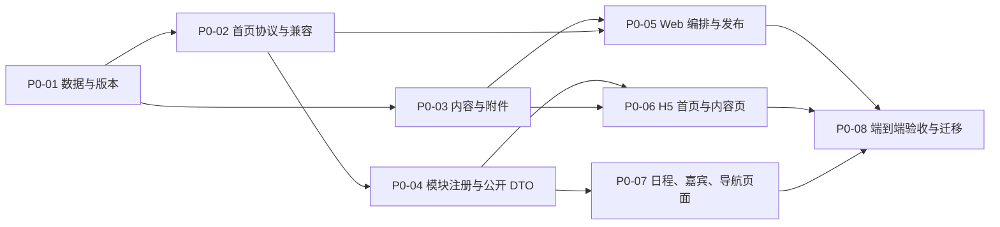

# Phase 1：P0 基础闭环

## 目标

交付一个可发布、可回滚、对旧会议兼容的移动端首页系统：运营在 Web 编排入口和内容，移动端只消费服务端返回的已发布协议；日程、嘉宾、导航、报名和内容页都以正确的公开/私有边界运行。

## 非目标

- 不在本阶段实现支付、多人同行、统一会员、学分申报或证书。
- 酒店、餐券、签到只完成首页状态占位与模型预留，不交付用户预约、核销或动态凭证。
- 不维持现有 `web-mobile/pages/meeting/module.vue` 的通用卡片页架构；该页可被模块专用页面替代。

## 依赖图

## 任务

### P0-01 版本化首页数据与迁移脚本

**状态：进行中（数据模型、Mapper、服务及可重复执行 SQL 已完成；待应用到目标数据库并完成真实回滚演练）**

在 `server/sql/` 新增可重复执行的迁移脚本，并新增首页版本实体、Mapper、服务和活动级生效版本读取能力。

**实现要求**

- 新增 `yc_activity_home_version`，至少保存活动、版本号、状态、schema 版本、`page_json`、发布备注、创建/发布信息和删除标记。
- 版本状态限定为 `draft/published/archived`；同一活动发布切换必须是事务性操作，保存草稿不影响线上。
- `page_json` 至少表达 `mode/theme/sections/entryTree`，并有服务端 schema 校验入口。
- 新增 `yc_meeting_content` 与受控附件关系表，为 P0 内容页提供持久化模型。
- 提供旧 `yc_activity_grid`、`mobile_blocks_json`、模板字段到新页面模型的纯转换服务；不得删除或原地改写旧数据。

**允许重构**

允许废弃将视觉配置塞入 `remark` 的新写入路径；旧值仅在转换器中读取。允许替换扁平 `mobileLayout` 组装逻辑。

**验收**

- 为一个新活动保存草稿、发布两版并回滚，移动端生效版本正确变化。
- 无新版的历史活动能由转换器得到合法页面模型。
- 无可见区块、非法目标、图片地图越界或入口树循环引用无法发布。

### P0-02 统一首页协议与兼容读取

**状态：进行中（统一首页协议、旧数据只读转换、入口状态计算与公开活动投影已完成；待运行中服务的接口验收）**

实现 `GET /portal/meeting/home/{activityId}`，替代 H5 对 `/activity`、`/grid` 和多个模块接口的首页拼装。

**实现要求**

- 返回活动公开字段、已发布版本、页面区块、入口树、能力状态和用户上下文。
- 登录态可影响 `context` 与入口状态，但匿名响应绝不携带订单、手机号、房号、用户券、嘉宾联系方式或管理字段。
- 新版本存在时仅读版本模型；不存在时读取旧数据转换结果。旧 `/portal/meeting/activity/{id}` 和 `/grid/{id}` 保持只读兼容。
- 服务端计算会议阶段、入口可见性、登录/报名要求、空数据状态和模块上下文；H5 不作业务推断。

**允许重构**

允许移除 H5 首页的多接口编排和旧 DTO 直出；不允许立即删除旧接口。

**验收**

- 一个请求足以渲染新 H5 首页和入口树。
- 同一活动的匿名与登录响应仅在允许的上下文、能力和私有字段上不同。
- 历史会议、新会议、已归档版本和非法活动 ID 均有明确行为。

### P0-03 统一内容页、资料与附件

**状态：进行中（内容/附件 CRUD、公开受控读取与双向 HTML 清洗已完成；待接入真实文件存储的签名下载）**

实现内容 CRUD、富文本安全处理、附件访问控制和 Portal 内容读取接口。

**实现要求**

- 内容支持标题、摘要、正文、封面、有效期、状态、公开范围和排序；入口只引用内容 ID。
- 附件独立管理文件名、类型、大小、有效期、下载权限和排序，禁止把私有文件 URL 硬编码在富文本中。
- 保存与输出两端清洗 HTML，拒绝脚本、事件属性、危险 URL 和未授权内嵌资源。
- 区分公开内容、登录可见、报名后可见；入口和内容详情均由服务端校验。

**允许重构**

允许用内容实体替代现有 `yc_activity_grid.content` 承载的新内容；旧字段仅转换为兼容内容快照。

**验收**

- 邀请函、通知、须知能用同一后台编辑器配置为文字、长图、多图和附件。
- 匿名用户无法下载受限附件或读取报名后内容。
- XSS、非法外链和失效附件无法保存或发布。

### P0-04 模块能力注册表与公开 DTO

**状态：进行中（嘉宾、日程、会场、导航的 Portal 公开 DTO 已完成；专用页面与模块注册表仍待完成）**

建立服务端与 Web 共享的模块能力定义，并替换现有“模块名 -> 通用列表”的直出方式。

**实现要求**

- 注册 `apply/schedule/guest/venue/nav/my-attendance` 的路由、管理页、登录要求、数据检查、空状态和可用上下文；P1 模块只可注册为未开放能力，不可伪装为可用。
- 新增日程、嘉宾、导航各自的 Portal DTO 和查询接口，禁止直接返回 JPA/Mapper 实体。
- 嘉宾公开 DTO 只含头像、姓名、机构、职务、简介、公开标签和关联场次；禁止手机号、身份证、行程、劳务、酒店字段。
- 日程支持日期、会场、主题筛选和 `venueId/topicId` 上下文；导航支持 POI/会场引用及有效坐标校验。
- 明确报名与我的参会的登录边界，复用当前微信授权和报名提交，不引入参考站账号密码登录。

**允许重构**

允许删除 `YcPortalMeetingServiceImpl.listModule` 对实体列表的通用分支，改为模块专用服务；允许下线 H5 对手机号的展示。

**验收**

- 同名栏目可以配置为 `content` 或 `module`，入口行为由目标类型而非标题决定。
- 日程、嘉宾、导航在匿名接口中无敏感字段；嘉宾详情可跳关联日程。
- 无排期或无坐标时返回明确模块状态，入口按规则隐藏或标记即将开放。

### P0-05 Web 首页编排、入口树与发布

**状态：待开始（依赖稳定的首页协议；后端发布 API 已可供工作台接入）**

将当前九宫格编辑升级为首页编排工作台，支持版本草稿和真实预览。

**实现要求**

- 提供标准导航/运营卡片两种 P0 模式；Tile 与图片地图保留读取兼容，图片地图编辑可后续分期。
- 入口编辑先选择 `group/content/module/file/map/external`，再显示对应字段；支持父子入口、排序、启停、入口图、显示条件和有效期。
- 内容选择器、POI 选择器、模块上下文选择器均使用受控数据源，不允许手写内部路由。
- 提供草稿保存、服务端校验、真实活动数据预览、发布备注、差异查看和恢复最近版本。
- 发布/回滚具备独立权限；内容编辑不自动获得发布权限。

**允许重构**

允许将现有表格设为高级兼容视图，替换其作为主配置体验的地位；允许迁移现有 `meetingModules.js` 为服务端注册表驱动的选项。

**验收**

- 新活动可在 5 分钟内创建默认首页、内容入口、日程入口并发布。
- 非法目标、无可见内容、循环入口树和私有模块匿名可用状态会阻断发布。
- Web 真实预览与 H5 使用同一接口，入口、状态和排序一致。

### P0-06 H5 首页、入口分发与统一内容页

**状态：进行中（首页已改为统一协议渲染，内容页与入口分发已接入；需补足分组和专用模块体验）**

重构 `web-mobile` 首页为新协议渲染器，并实现内容页和受控入口分发。

**实现要求**

- `home.vue` 只获取统一首页协议并选择页面区块组件；不再分别读取旧活动、宫格和配置字段。
- 支持 `group/content/module/file/map/external`，并在进入前消费服务端给出的状态与登录要求。
- 内容页支持面包屑、已发布入口树侧栏、富文本、全宽长图、多图、图片预览、附件和受限状态。
- 外链仅打开服务端允许的 `http/https` 目标；地图使用服务端返回的 POI 能力；文件按类型预览/下载/提示。
- 旧模板页面仍可从兼容协议渲染，旧客户端保持可访问。

**允许重构**

允许拆分或移除当前 `home.vue` 中的模板、跳转和布局混合逻辑；允许废弃通用 `module.vue` 作为所有模块的默认页面。

**验收**

- 标准首页、运营卡片、旧九宫格转换页均可渲染。
- 内容、文件、地图、外链和登录模块的跳转类型正确；无可用动作不显示为可点击入口。
- H5 不包含资格、库存或可见性计算的重复逻辑。

### P0-07 日程、嘉宾与导航专用 H5 页面

**状态：待开始**

以专用页面替代通用卡片列表，完成 P0 原生模块体验。

**实现要求**

- 日程页：日期、会场、主题筛选；当前/下一场状态；详情、讲者、会场和资料跳转。
- 嘉宾页：姓名搜索、公开筛选、详情与关联日程；仅渲染公开 DTO。
- 导航页：POI/会场列表、详情、地址、电话与地图唤起；坐标无效时不显示导航按钮。
- 首页“下一场”消费服务端计算结果，不自行按浏览器时间重算。

**允许重构**

允许替换 `pages/meeting/module.vue`，并移除其按字段猜测标题/副标题的逻辑。

**验收**

- 分会场入口带 `venueId/topicId` 上下文后只展示正确日程。
- 嘉宾手机号等敏感字段不存在于 DOM、网络响应和页面状态。
- 从日程可到会场导航和嘉宾详情，返回路径稳定。

### P0-08 迁移演练、权限审计与端到端验收

**状态：待开始**

使用至少一个旧会议和一个新会议完成迁移演练，并验证发布、回滚、公开范围和主要用户旅程。

**实现要求**

- 为旧会议生成转换后的预览，不改写源配置；确认标准、Tile 和图片地图至少各有一个兼容样本。
- 建立接口和浏览器验收清单：匿名首页、登录后报名、内容权限、日程筛选、嘉宾脱敏、POI 导航、发布和回滚。
- 记录不兼容旧配置、手工修复步骤和可回滚策略；对非法外链、XSS、失效附件和越界热区执行负面测试。

**验收**

- 新旧会议均能访问；回滚不会删除版本或旧数据。
- 匿名响应和页面不存在隐私字段，私有接口正确拒绝越权。
- 发布前校验、发布后刷新和版本回滚能在浏览器中复现并留存证据。

## Phase 1 完成条件

所有 P0 任务已完成，且满足以下结果：运营可以建立并发布一个含内容、日程、嘉宾和导航入口的会议首页；移动端通过单一协议渲染；旧会议不受影响；公开接口和页面没有个人或后台敏感字段；发布、回滚与迁移路径经过实际验证。
