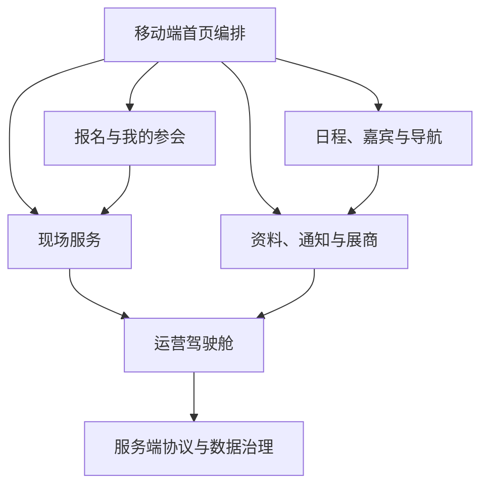

# 会议产品总览

## 1. 产品定位

将当前移动端从“会议信息展示页”升级为参会者的会议服务台：会前帮助用户完成报名和准备，会中帮助用户抵达、签到、参会和获取服务，会后帮助用户回看、下载资料和反馈。

“九宫格配置”不再是产品总称，而是首页中的一种功能导航组件。管理端统一使用“移动端首页编排”作为产品名称；历史菜单、权限和接口在迁移期保留兼容名称。

## 2. 用户与目标

| 角色 | 目标 | 主要痛点 |
| --- | --- | --- |
| 会议运营 | 快速发布准确的会议服务 | 配置分散、误操作直接上线、空入口 |
| 项目负责人 | 确保品牌和信息层级正确 | 无法可靠预览、缺少发布回滚 |
| 现场工作人员 | 完成签到、核销和应急通知 | 人工查询多、状态不一致 |
| 参会者 | 在正确时间完成正确事情 | 不知道下一步、入口分散、信息过期 |

## 3. 参会者旅程

| 阶段 | 用户问题 | 首屏应主推 |
| --- | --- | --- |
| 会前 | 如何报名、会议是否值得参加、怎么到达 | 报名、亮点、日程预览、嘉宾、交通住宿 |
| 报名后 | 是否成功、还要准备什么 | 我的参会、电子凭证、待办、行程 |
| 会中 | 下一场去哪、怎么签到、如何领餐 | 今日议程、签到、会场导航、餐券、通知 |
| 会后 | 资料和回放在哪里、如何反馈 | 资料、回放、反馈、联系方式 |

会议阶段由服务端根据活动时间和配置计算，管理员可配置每阶段的主推区块和入口排序。

## 4. 产品原则

1. 默认可用：新会议自动生成有数据才显示的常用服务入口。
2. 状态优先：用户看到的是“可报名、待审核、下一场、可核销”等动作状态，而不是静态菜单。
3. 配置可控：草稿、校验、预览、发布、回滚分离。
4. 服务端裁决：可见性、资格、阶段、库存和权益统一由服务端判断。
5. 隐私最小化：匿名首页绝不返回订单、房号、手机号等私密数据。
6. 保留历史：现有 `yc_activity_grid` 等数据先转换兼容，不能用重建替换迁移。
7. 入口复用：邀请函、会议通知、会议须知、组织机构、学分须知、联系我们等优先复用统一内容页，不能因栏目名称不同重复建设业务页面。

## 5. 总体功能地图

## 6. 范围与优先级

### P0：最小可用闭环

- 统一移动端首页协议、草稿发布和真实预览；
- 标准导航/运营卡片首页；
- 报名状态与“我的参会”基础页；
- 日程、当前/下一场、会场导航；
- 内容资料页；
- 入口树和统一内容页（富文本、长图、附件、外链）；
- 配置校验和旧数据兼容。

### P1：现场服务闭环

- 电子凭证和签到；
- 日程收藏、变更提醒；
- 酒店用户服务、分房展示；
- 用户餐券、核销；
- 通知中心与运营驾驶舱。

### P2：运营和体验增强

- 可视化拖拽、自由 Tile；
- 展商互动、回放、反馈、证书；
- 定时发布、自动阶段切换、数据看板。

### P3：须单独立项的能力

- 在线支付、多人同行报名、社交通讯录、AI 推荐、统一会员体系。

这些功能涉及支付、身份、隐私或复杂运营规则，不属于首页改造的默认范围。
