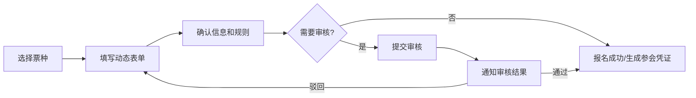

# 报名与我的参会

## 1. 目标

将报名从一次表单提交升级为可追踪的资格申请闭环，并为登录用户提供“我的参会”个人服务中枢。

## 2. 报名通道与票种

现有 `yc_apply_channel` 可以继续承载报名通道，需将对外票种和内部管理拆开：

- 对外名称、内部名称、参会身份标签；
- 开售/截止/展示时间；
- 名额与展示策略；
- 邀请码批次、有效期、使用额度；
- 审核规则与 SLA 文案；
- 取消规则和截止时间；
- 报名通过后可获得的权益：餐券、酒店资格、直播权限、资料权限。

## 3. 报名状态机

| 状态 | 含义 | 用户动作 |
| --- | --- | --- |
| `draft` | 表单草稿 | 继续填写或放弃 |
| `submitted` | 已提交待审核 | 查看审核时效 |
| `approved` | 已通过 | 查看凭证和参会服务 |
| `rejected` | 被拒绝 | 查看原因、按规则重新提交 |
| `waitlist` | 候补 | 查看说明或顺位 |
| `cancelled` | 已取消 | 按规则重新报名 |
| `expired` | 资格或时限过期 | 查看原因 |
| `checked_in` | 已签到 | 查看签到时间和现场服务 |

现有订单的报名/签到字段用于兼容；审核结果、拒绝原因、状态时间、身份权益和凭证必须结构化扩展。

## 4. 移动端报名流程

- 表单自动保存草稿；
- 提交前展示隐私说明、取消规则和必填校验；
- 审核中可查看进度；
- 驳回时必须展示原因和是否可重新提交；
- 成功页应引导用户进入“我的参会”、查看日程和交通住宿。

## 5. 我的参会

页面由以下卡片组成：

1. 身份卡：姓名、单位、票种/身份、报名编号、审核状态。
2. 电子凭证：动态码、有效期、签到状态。
3. 我的待办：补资料、待审核、待签到、待选酒店、待领餐券。
4. 我的日程：下一场、倒计时、会场导航。
5. 我的服务：酒店订单、房间分配、餐券、行程、收藏资料、客服。
6. 消息中心：未读通知和与本人相关的提醒。

该页面必须要求登录，且只返回当前用户在当前活动下的私有数据。

## 6. Web 管理端

- 按状态、票种、时间、姓名/手机号筛选报名记录；
- 批量审核、人工调整身份、导出；
- 审核拒绝必须填写原因；
- 配置“审核通过自动生成凭证”；
- 查看参会者服务全景：签到、酒店、餐券、通知记录；
- 所有人工状态变更写入审计日志。

## 7. 服务端规则

- 同一用户重复报名、名额和截止时间必须由服务端原子校验；
- 订单状态、支付状态（未来）和签到状态分离；
- 不得以客户端回调作为成功的唯一依据；
- 用户私有接口必须验证活动归属和当前用户归属；
- 资格权益由服务端聚合，首页入口只消费计算后的结果。

## 8. 验收

- 用户能始终看到报名当前状态和下一步；
- 管理员审核后，用户端状态和通知一致；
- 用户无法访问他人的订单、凭证、房号或联系方式；
- 取消、审核、签到变化会同步更新首页和“我的参会”。
