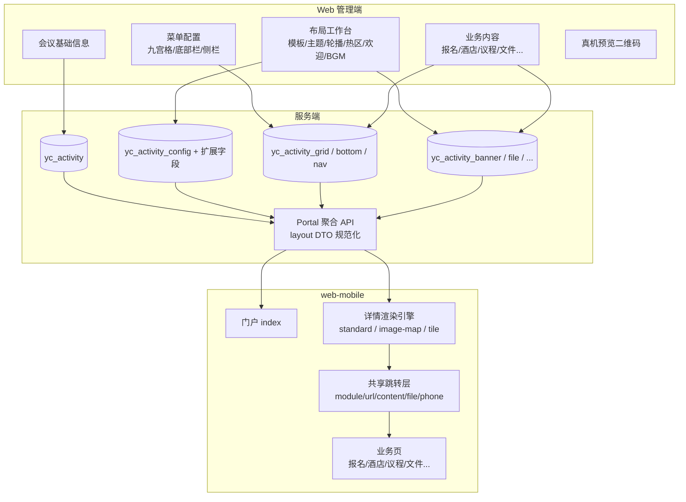

# 移动端配置体系改造计划（审阅稿）

> 目标：让 **Web 管理端 + 服务端** 能稳定配置出会议移动端的布局与模样，使 **web-mobile** 体验接近参考站 [ztmeeting.com/mp](http://ztmeeting.com/mp/#/) 与会议微站 [mm.sciconf.cn/minisite](https://mm.sciconf.cn)。  
> 范围：改造管理端配置能力、服务端模型/API、移动端渲染与业务深度；不含参考站全部长尾能力（商城/考试/论文等放入后续）。  
> 状态：一期（仅九宫格）开发中。

---

## 当前执行口径（已确认）

> **一期主线：标准九宫格（standard）**，本轮已扩展支持参考站 38569 所需的 `tile` 不规则宫格和基础音频/长图能力。
> 热区 JSON / image-map / 欢迎大图等仍后置到后续阶段。
> 本期目标：后台配置九宫格模板与菜单后，移动端详情页能正确按 1/2/3 列、Tile 行列跨度、纯图标/图文样式渲染，并消费倒计时样式、主题色、报名人数、底部栏图标。

已落地代码（本轮）：
- 服务端 mobileLayout 下发 gridTemplate/gridColumns/gridStyle/countdownStyle/showRegisterCount
- 移动端 home.vue + utils/meetingLayout.js 消费上述字段
- 管理端九宫格预览对齐列数/纯图标/主题色/倒计时提示
- `tile` 不规则宫格支持行、列、跨行、跨列和入口背景图
- 内容页支持文字与长图，移动端新增图片浏览页
- 会议配置支持背景音乐地址、自动播放和循环播放
- 报名通道下发截止状态，移动端展示截止提示并禁止进入表单
- 数据库迁移脚本：`server/sql/meeting_mobile_rich_layout.sql`
- 38569 参考会议示例数据：`server/sql/seed_ref_38569_tile.sql`（本地 activityId=11）


---

## 1. 背景与目标

### 1.1 业务定位

| 端 | 职责 |
|----|------|
| **Web 管理端** (`web/`) | 运营人员配置会议信息、布局模板、九宫格/热区、底部栏、报名/酒店等内容 |
| **服务端** (`server/`) | 持久化配置、校验、门户聚合 API 下发 |
| **移动端** (`web-mobile/`) | 按配置渲染门户与会议详情，承接报名/议程/酒店等交互 |

一句话：**配置驱动渲染**。参考站每个会议详情“长得不一样”，本质是模板 + 素材 + 菜单/热区配置不同，而不是每个会议单独写一套前端。

### 1.2 参考站拆解（我们要对齐的东西）

**A. 门户层（ztmeeting）**

- 轮播 / 快捷入口（搜会议、公司介绍、联系我们）
- 热门会议 + 近期会议
- 底部 Tab：当前会议 / 历史会议
- 手机号登录（部分功能需登录）

**B. 会议详情层（多数跳 mm.sciconf.cn minisite）**

实测至少三种版式：

| 版式 | 代表会议 | 特征 |
|------|----------|------|
| `image-map` 路径热区 | 36113 眼科 | 整图背景 + 热区按钮 + 欢迎弹窗 + BGM |
| `image-map` 瓷砖热区 | 39047 抗癫痫 | 不对称磁贴墙 + 文件下载入口 + 侧栏内容页 |
| `standard` 标准组件 | 38313 / 38736 | Banner 轮播 + 倒计时样式 + 2 列图片宫格 |

**C. 会议内高频模块**

报名、议程、住宿、会议须知、学分须知、会场指引、文件下载、任务查询、云展厅、联系我们、讲者查询等。

### 1.3 改造目标（成功标准）

1. 运营在管理端 **不写代码**，可选模板并可视化配置，即可发布会议 H5。
2. 同一套移动端代码，能渲染出接近参考站的 **三种详情模样**。
3. 门户首页视觉与交互接近参考站（双 Tab、热门/近期、快捷入口；轮播可配置）。
4. 配置开关不再“空转”：后台勾选的项，C 端必须有对应表现。
5. 外链会议（`thirdPartyUrl`）与原生配置会议并存，互不影响。

---

## 2. 现状诊断

### 2.1 已具备（可复用）

- 配置中枢：`web/src/views/meeting/activity/config.vue`
- 双模板字段：`mobile_template = standard | image-map`
- 热区 JSON：`mobile_blocks_json`（百分比坐标 + linkType）
- 九宫格 / 底部栏 CRUD + 门户 API
- 门户列表 current/history + 外链跳转
- 报名通道 + 动态字段 + MpToken 登录骨架
- 酒店/会场/嘉宾/展商/餐票等主数据与通用列表页

### 2.2 核心落差

| 层级 | 问题 |
|------|------|
| 管理端 | 热区靠手写 JSON；无可视化编辑；无欢迎图/BGM/文件模块配置 UI；很多开关无可视预览 |
| 服务端 | 缺音频/欢迎图/Banner 列表/文件清单等字段；`mpShow/homeBanner/hotShow` 未驱动门户；无 blocks schema 校验 |
| 移动端 | `gridTemplate`/`countdownStyle`/`themeColor` 未真正消费；无轮播/BGM/欢迎图弹窗；模块多为列表壳；缺学分/任务/文件/云展厅独立页 |
| 体系 | 「能配」与「能渲染」脱节，参考站还原度不足 |

### 2.3 改造原则

1. **先打通配置→渲染闭环**，再扩业务深度。  
2. **模板有限枚举**，素材与菜单可配，避免无限自定义前端。  
3. **一份 layout schema，三端共用**（管理预览 / 门户 API / H5 渲染）。  
4. **渐进增强**：P0 对齐模样，P1 对齐主流程，P2 对齐长尾。  
5. **外链会议继续走 `thirdPartyUrl`**，不强制全部迁入原生模板。

---

## 3. 目标架构



### 3.1 统一 Layout DTO（门户下发契约）

建议 `/portal/meeting/activity/{id}` 的 `layout` 扩展为：

```json
{
  "template": "standard | image-map | tile",
  "themeColor": "#1f6feb",
  "backgroundUrl": "",
  "bannerList": [{ "imageUrl": "", "linkType": "none|url|module", "linkValue": "" }],
  "countdown": { "enabled": true, "style": "classic|simple|digital" },
  "welcome": { "enabled": true, "imageUrl": "", "title": "", "content": "", "oncePerDay": true },
  "audio": { "enabled": true, "url": "", "autoplay": true, "loop": true },
  "grid": {
    "template": "grid2xN | grid3x3 | ...",
    "style": "icon-text | image-card",
    "items": []
  },
  "blocks": [],
  "sideMenu": { "enabled": true, "source": "grid" },
  "bottom": [],
  "showRegisterCount": false
}
```

说明：

- 管理端保存时写入 DB；门户组装时输出该 DTO。  
- 移动端 **只认 DTO**，不散落读取一堆扁平字段。  
- 内容页顶部栏与侧栏不另设菜单数据源：`sideMenu.source=grid`，直接复用当前会议启用的九宫格项及其排序、标题、链接配置。
- 旧字段兼容：无 banner 表时可用 `coverUrl` 退化成单图 banner。

---

## 4. 配置模型改造（数据层）

### 4.1 `yc_activity_config` 扩展

| 字段 | 类型 | 说明 |
|------|------|------|
| `mobile_template` | varchar | 扩枚举：`standard` / `image-map` / `tile` |
| `mobile_grid_style` | varchar | `icon-text`（文字图标）/ `image-card`（参考站 2 列图片按钮） |
| `welcome_image_url` | varchar | 欢迎弹窗大图（对齐 welcome.jpg） |
| `welcome_mode` | varchar | `none` / `text` / `image` / `image+text` |
| `audio_url` | varchar | 背景音乐 |
| `audio_autoplay` | char(1) | 是否自动播放 |
| `mobile_theme_color` | varchar | 会议首页与内容区的主题色；内容页顶部栏沿用参考站模板蓝色 |

> 侧栏不新增 `side_menu_json` 或独立菜单表。内容页顶部栏的“首页 > 当前项”、汉堡侧栏及各项跳转，均由 `yc_activity_grid` 生成；九宫格配置一次，首页入口和内容页导航同时生效。

保留并真正启用：`show_countdown`、`countdown_style`、`show_register_count`、`home_banner`、`hot_show`、`mp_show`、`mobile_theme_color`、`mobile_background_url`、`mobile_blocks_json`、`mobile_notice`。

### 4.2 新增 `yc_activity_banner`（门户/详情轮播）

| 字段 | 说明 |
|------|------|
| banner_id / activity_id | 主键；`activity_id=0` 表示门户全局轮播 |
| image_url / title | 素材 |
| link_type / link_value | none / url / module / activity |
| sort_order / status | 排序与启停 |
| scope | `portal` / `meeting` |

> 若短期不想加表，P0 可用 `yc_activity_config.banner_json`；P1 再拆表，便于运营拖拽排序。

### 4.3 新增 `yc_activity_file`（会议文件）

| 字段 | 说明 |
|------|------|
| file_id / activity_id | |
| file_name / file_url / file_type | pdf/image/other |
| category | 议程/须知/学分/其他 |
| sort_order / status | |

门户增加 `moduleKey=file`，移动端提供文件列表页（下载/预览）。

### 4.4 模块目录扩展（三端同步）

在 `web/src/utils/meetingModules.js` 与 `web-mobile/utils/meetingModules.js` 同步扩展：

| key | 用途 | 优先级 |
|-----|------|--------|
| `schedule` | 议程（增强为日程视图） | P0 |
| `apply` | 报名 | 已有 |
| `hotel` | 酒店（补订房） | P1 |
| `guest` | 嘉宾 | 已有 |
| `venue` / `nav` | 会场/导航 | P1 增强 |
| `exhibitor` | 展商（可演进云展厅） | P1 |
| `meal` | 餐票 | P2 |
| **`file`** | 文件下载 | P0 |
| **`notice`** | 会议须知（富文本/图） | P0 |
| **`credit`** | 学分须知 | P1 |
| **`task`** | 任务查询 | P1 |
| **`contact`** | 联系我们 | P0 |
| **`gallery`** | 云展厅（可先外链/图集） | P2 |

### 4.5 `mobile_blocks_json` Schema 规范化

强制字段校验（服务端保存时校验）：

```json
{
  "id": "blk_apply",
  "title": "参会报名",
  "left": 10, "top": 40, "width": 28, "height": 10,
  "shape": "rect",
  "showTitle": true,
  "iconUrl": "",
  "bgMode": "transparent | solid | image",
  "linkType": "module | url | content | file | phone",
  "moduleKey": "apply",
  "externalUrl": "",
  "content": "",
  "fileId": null,
  "phone": ""
}
```

`tile` 模板可复用同一 blocks，仅渲染风格不同（磁贴阴影/圆角/双语副标题可选）。

---

## 5. 服务端改造

### 5.1 管理端 API

| 改造项 | 说明 |
|--------|------|
| `PUT /meeting/config` | 支持新字段；blocks JSON schema 校验 |
| Banner CRUD | `/meeting/banner` 或 config 内嵌 JSON |
| File CRUD | `/meeting/file` |
| 预览接口 | `GET /meeting/config/preview/{activityId}` 返回与门户一致的 layout DTO |
| 模块列表 | `listModule` 增加 `file` / `notice` / `credit` / `task` / `contact` |

### 5.2 门户 API

| 接口 | 改造 |
|------|------|
| `GET /portal/meeting/list` | 尊重 `mp_show`；热门逻辑统一（建议 `is_hot` 与 `hot_show` 明确分工并文档化） |
| `GET /portal/meeting/banners` | 门户轮播 |
| `GET /portal/meeting/activity/{id}` | 返回完整 layout DTO + activity + 业务开关 |
| `GET /portal/meeting/files/{activityId}` | 文件列表 |
| `GET /portal/meeting/module/{key}/{id}` | 扩展 moduleKey；agenda 可返回按日分组结构 |

### 5.3 兼容策略

- 旧会议无新字段：默认 `welcome_mode=text`（用 `mobile_notice`）、无音频、banner 退化为 cover。  
- `mobile_template` 非法值回退 `standard`。  
- blocks 解析失败时返回空数组并打日志，避免详情白屏。

### 5.4 建议新增 SQL 脚本

- `server/sql/meeting_mobile_layout_v2.sql`（config 扩展字段）  
- `server/sql/meeting_banner.sql`  
- `server/sql/meeting_file.sql`  
- 更新 `mobile_reference_demo.sql`：三类模板各 1 个可演示会议（standard / image-map / tile）

---

## 6. Web 管理端改造

### 6.1 「移动端布局工作台」（替代当前纯 JSON 弹窗）

入口：会议配置中枢 → **移动端布局**（升级现有 mobile 抽屉为独立页或大抽屉）。

#### 区域 A：模板与主题

- 模板选择（带缩略预览图）：标准页 / 宣传图热区 / 瓷砖热区  
- 主题色、背景图上传  
- 九宫格样式：`icon-text` / `image-card`  
- 倒计时开关节 + 样式预览  
- 显示报名人数开关  

#### 区域 B：氛围能力

- 欢迎弹窗：模式、图片、文案、是否每日一次  
- 背景音乐：上传 mp3、自动播放/循环  
- 会议内 Banner 多图管理（standard 用）  

#### 区域 C：可视化热区编辑器（P0 重点）

- 左侧上传背景图，右侧属性面板  
- 在图上拖拽添加矩形热区，改位置/尺寸  
- 绑定动作：模块 / 外链 / 富文本 / 文件 / 电话  
- 实时生成 `mobile_blocks_json`，保留「高级 JSON」折叠面板给开发排错  
- 提供「从参考会议复制布局」能力（可选）

#### 区域 D：菜单与底部

- 继续用现有九宫格、底部栏页，但：  
  - 与 layout 工作台互相跳转  
  - 预览区同步显示  
  - 图片宫格支持上传「整块入口图」（对齐 38313）

#### 区域 E：真机预览

- 右侧 iframe / 二维码打开 H5  
- 切换模板立即预览（保存后刷新）

### 6.2 其它管理端改造

| 模块 | 改造 |
|------|------|
| 九宫格 | C 端消费 `gridTemplate`；图标/入口图上传体验统一；清理 remark 塞样式的做法，逐步字段化 |
| 底部栏 | 支持图标必填提示；预览显示图标 |
| 报名 | 恢复价格/审核/邀请码等域字段到 UI（可分阶段） |
| 文件 | 新菜单「会议文件」 |
| 门户运营 | 全局 Banner 管理（activity_id=0） |
| 公司介绍/联系我们 | 门户 CMS 简易页（可用现有 content 或独立配置） |

### 6.3 交互原则

- 运营主路径：**选模板 → 上传主视觉 → 配菜单/热区 → 配欢迎/音乐 → 预览 → 发布**  
- 危险操作（清空热区、切换模板）需二次确认并提示「可能丢失坐标」  

---

## 7. 移动端改造

### 7.1 门户 `pages/meeting/index`

对齐参考站：

1. 顶部可配置轮播（portal banners）  
2. 快捷入口：搜会议 / 公司介绍 / 联系我们（可配置开关）  
3. 保留并强化：热门会议、近期会议、底部当前/历史 Tab  
4. 搜索体验保持  
5. 视觉：主题色、卡片样式靠近参考站（不必像素级，但结构一致）

### 7.2 详情渲染引擎 `pages/meeting/home`

拆成模板组件：

```
components/meeting-home/
  HomeStandard.vue      # 轮播 + 倒计时样式 + 宫格 + 底部
  HomeImageMap.vue      # 背景图 + 透明/半透明热区 + 欢迎 + BGM
  HomeTile.vue          # 瓷砖风格（可复用 blocks 数据）
  parts/
    WelcomeModal.vue
    BgAudio.vue
    CountdownBoard.vue
    GridMenu.vue
    BottomBar.vue
    SideMenu.vue
```

`home.vue` 只负责拉数、选模板、共享跳转。

#### standard 必做

- Banner swiper（多图）  
- `countdownStyle` 三套样式  
- `gridStyle=image-card` 时 2 列大图入口  
- 主题色应用到标题/激活态/按钮  
- `showRegisterCount`  

#### image-map / tile 必做

- 热区可「只热区不显示脏边框」（`bgMode=transparent`）  
- 欢迎图弹窗（大图 + 关闭）  
- BGM 悬浮按钮（播放/暂停）  
- 可选底部栏叠加  

### 7.3 共享跳转层

统一处理 `linkType`：

| linkType | 行为 |
|----------|------|
| module | 进对应业务页 |
| url | webview |
| content | 富文本/图文页（升级现有 textview） |
| file | 文件预览/下载 |
| phone | 拨号 |
| none | 无动作 |

### 7.4 业务页深度（按优先级）

| 页面 | P0 | P1 |
|------|----|----|
| 报名 | 保持并打磨 | 支付/审核态 |
| 议程 | 按日分组列表 | 讲者搜索、会场筛选 |
| 文件 | 列表 + 预览 | 分类 Tab |
| 会议须知/联系我们 | 图文页 | — |
| 酒店 | 列表 | 选房下单 |
| 学分/任务 | 占位或图文 | 查询表单 |
| 会场/导航 | 列表+地图 | 多点路线 |
| 云展厅 | 外链 | 内置图集/展商详情 |
| 侧栏内容壳 | — | 汉堡菜单 + 内容页框架 |

### 7.5 外链会议体验

- 列表点 `thirdPartyUrl` 仍可 webview / 系统浏览器打开  
- 可选：webview 顶栏显示「返回会议广场」  
- 原生会议与外链会议在列表用小标签区分（可选）

---

## 8. 分期计划

### 阶段 0：契约与开关打通（约 3–5 天）

**目标**：现有字段真正生效，消除“空转配置”。

- [ ] 门户 layout DTO 规范化（兼容旧数据）  
- [ ] 移动端消费：`countdownStyle`、`themeColor`、`showRegisterCount`、`gridTemplate`（至少 2/3 列）  
- [ ] 列表尊重 `mp_show`；明确 `is_hot` / `hot_show` 规则并改代码+文档  
- [ ] 底部栏显示 `iconUrl`  
- [ ] Demo 数据自测三会议可打开  

**验收**：后台改倒计时样式/主题色/是否显示人数，H5 立即可见差异。

---

### 阶段 1：P0 模样对齐（约 2–3 周）【核心】

**服务端**

- [ ] config 扩展：welcome/audio/grid_style/template=tile  
- [ ] banner（表或 JSON）、file 表 + CRUD  
- [ ] blocks schema 校验  
- [ ] portal files / banners 接口  
- [ ] 更新 demo SQL（三类模板）  

**管理端**

- [ ] 布局工作台 v1（模板切换、欢迎图、BGM、Banner）  
- [ ] 热区可视化编辑器 v1（拖拽矩形 + 绑定模块/链接）  
- [ ] 文件管理页  
- [ ] 预览二维码  

**移动端**

- [ ] HomeStandard：轮播 + 倒计时样式 + image-card 宫格  
- [ ] HomeImageMap / HomeTile：热区体验 + 欢迎图 + BGM  
- [ ] 模块：`file` / `notice` / `contact`  
- [ ] 门户：轮播 + 快捷入口页（公司介绍/联系我们可先静态可配）  
- [ ] 议程按日分组  

**验收对照**

| 参考会议 | 本地应对 |
|----------|----------|
| 38313 | standard + 轮播 + 倒计时 + 2 列图宫格 |
| 36113 | image-map + 欢迎图 + BGM + 热区 |
| 39047 | tile 或 image-map 瓷砖素材 + 文件入口 |

---

### 阶段 2：P1 主流程闭环（约 2–3 周）

- [ ] 酒店选房下单（对接现有 hotel order）  
- [ ] 报名：价格展示/审核状态（按现有域字段逐步开放）  
- [ ] `credit` / `task` 模块页  
- [ ] 会场指引图文增强、导航多点  
- [x] 侧栏菜单（内容页汉堡，复用会议九宫格）
- [ ] 展商详情/外链  
- [ ] 管理端九宫格预览与真机一致  

**验收**：一条「浏览会议 → 报名 → 看议程 → 下酒店单 → 下文件」完整路径可跑通。

---

### 阶段 3：P2 体验增强与长尾（按需）

- [ ] 云展厅  
- [ ] 直播模块对接  
- [ ] 门户登录后的「我的报名/我的酒店」聚合  
- [ ] 电脑版入口（可选）  
- [ ] 更丰富 gridTemplate 动画样式  
- [ ] 布局「另存为模板库」供新会议一键套用  

---

## 9. 任务拆分（按仓库）

### 9.1 server

1. SQL 迁移脚本与实体/Mapper 同步  
2. Config upsert 校验与 layout 组装  
3. Banner/File CRUD + Portal API  
4. Module 扩展与 agenda 分组 DTO  
5. Demo 数据三模板对齐参考素材（`static/reference/**`）  

### 9.2 web

1. 布局工作台页面信息架构  
2. 热区编辑器组件（建议独立 `components/meeting/HotspotEditor.vue`）  
3. Banner/File 管理视图  
4. 模块目录与表单项扩展  
5. 预览与发布提示  

### 9.3 web-mobile

1. layout 解析与模板路由组件化  
2. 门户视觉对齐  
3. 业务页：file/notice/contact/schedule 增强  
4. 酒店下单（P1）  
5. 音频与欢迎弹窗体验细节（自动播放受限时的引导）  

---

## 10. 验收清单（审阅用）

### 配置闭环

- [ ] 新建会议 → 选 standard → 配轮播/倒计时/宫格 → H5 一致  
- [ ] 同一会议改 image-map → 上传背景 → 拖 3 个热区 → H5 可点  
- [ ] 配欢迎图 + BGM → 进入详情可见可关  
- [ ] 配文件模块 → H5 可预览 PDF/图片  
- [ ] 关闭 `mp_show` → 门户不再展示  

### 参考站相似度（主观评审）

- [ ] 门户结构一眼可辨（轮播/入口/热门/近期/双 Tab）  
- [ ] 三类详情模板并排对比，布局类型可区分  
- [ ] 主路径模块不缺失（报名/议程/须知/文件/联系）  

### 兼容

- [ ] 旧会议无新字段不报错  
- [ ] `thirdPartyUrl` 会议仍可打开  
- [ ] 管理端旧 JSON 热区仍可解析  

---

## 11. 风险与对策

| 风险 | 对策 |
|------|------|
| 热区编辑器开发量大 | P0 只做矩形拖拽+属性面板；多边形/吸附放到 P2 |
| 微信/浏览器限制自动播放音频 | 默认静音图标，首次点击解锁；保留开关 |
| 参考站大量能力易范围膨胀 | 严格按阶段；商城/考试/论文不进本期 |
| 配置字段继续膨胀难维护 | 以 layout DTO 为中枢；新能力先 JSON，稳定再拆表 |
| 管理端预览与真机不一致 | 预览直接打门户 API + 同一套 H5 路由 |
| 外链 minisite 与原生双轨 | 明确：复杂定制可继续外链；平台内会议走模板配置 |

---

## 12. 建议决策点（请审阅时拍板）

1. **第三模板命名**：`tile` 是否独立？还是 `image-map` + `skin=path|tile`？  
   - 建议：**独立 `tile`**，运营更好懂；底层可共用 blocks。  
2. **Banner 是否独立表**：P0 JSON 还是直接建表？  
   - 建议：门户全局 Banner 建表；会议 Banner P0 可用 JSON，P1 合并。  
3. **酒店订房是否进 P0**：  
   - 建议：**P1**；P0 先保证模样与文件/须知/报名。  
4. **是否要 1:1 像素还原参考站**：  
   - 建议：结构与能力对齐，视觉「神似」即可，避免锁死单一视觉。  
5. **外链会议策略**：继续允许 `thirdPartyUrl` 作为「高级定制出口」？  
   - 建议：**保留**，作为无法用模板表达时的逃生舱。  

---

## 13. 推荐实施顺序（一句话）

**先打通开关与 layout 契约 → 做可视化布局工作台与三类模板渲染 → 补文件/须知/门户轮播 → 再做酒店/学分等业务深度。**

---

## 附录 A：关键路径速查

| 端 | 路径 |
|----|------|
| 管理配置中枢 | `web/src/views/meeting/activity/config.vue` |
| 九宫格/底部 | `web/src/views/meeting/grid/index.vue`、`bottom.vue` |
| 模块目录 | `web/src/utils/meetingModules.js` |
| 配置实体 | `server/.../domain/YcActivityConfig.java` |
| 门户服务 | `server/.../impl/YcPortalMeetingServiceImpl.java` |
| 门户控制器 | `server/.../portal/PortalMeetingController.java` |
| 移动详情 | `web-mobile/pages/meeting/home.vue` |
| 移动门户 | `web-mobile/pages/meeting/index.vue` |
| Demo SQL | `server/sql/mobile_reference_demo.sql` |
| 参考素材 | `server/ruoyi-admin/src/main/resources/static/reference/` |

## 附录 B：参考站样本

| ID | 类型 | URL |
|----|------|-----|
| 门户 | ztmeeting | http://ztmeeting.com/mp/#/ |
| 36113 | image-map | https://mm.sciconf.cn/cn/minisite/index/36113 |
| 39047 | tile/image-map | https://mm.sciconf.cn/cn/minisite/index/39047 |
| 38313 | standard | https://mm.sciconf.cn/cn/minisite/index/38313 |

---

文档版本：v1（审阅稿）  
编写说明：基于当前仓库实现与参考站实测整理，供产品/研发确认范围与分期后再开工。
